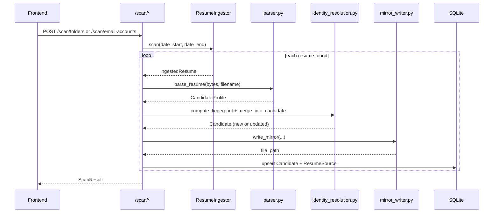
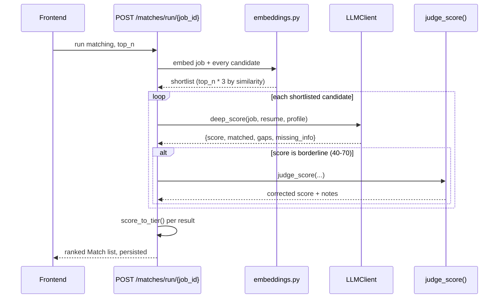

<!-- Version: v0 | Last updated: 2026-08-01 | Status: current -->

# Data Flow

## Ingestion (folder or email — same pipeline)

## Matching

## Draft email

`POST /draft-email {match_id}` reads the persisted `Match` (job + candidate + reasons),
checks the four required fields on the candidate, and asks the LLM to write a draft
referencing the specific matched strengths — not a generic template.
