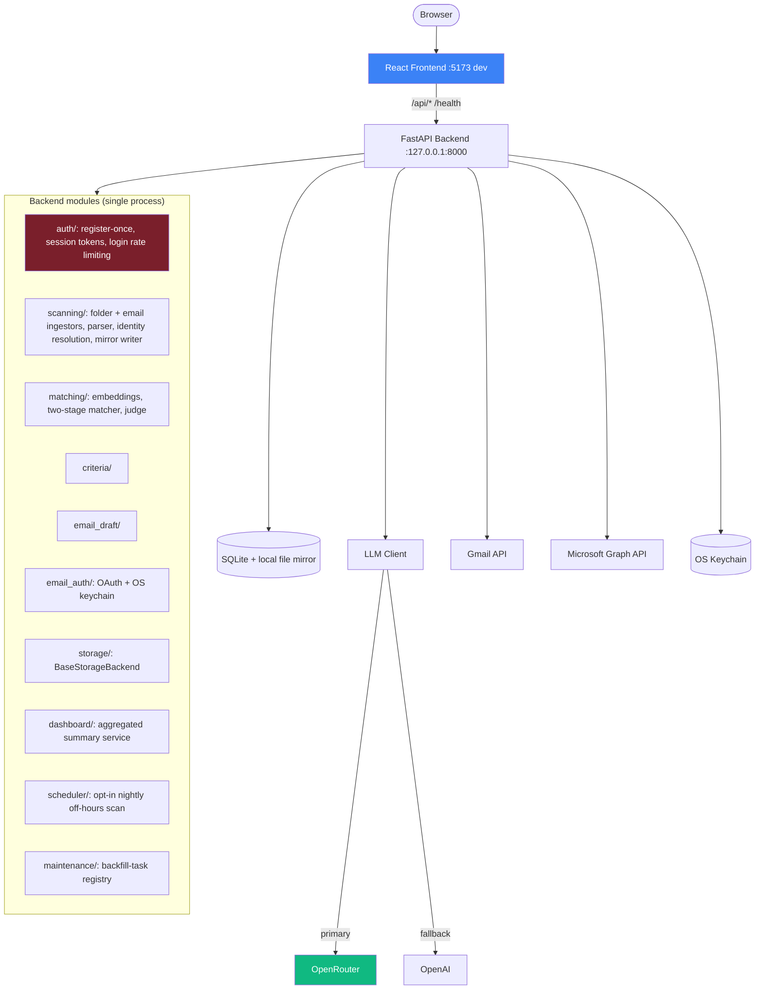

<!-- Version: v0 | Last updated: 2026-09-01 | Status: current -->

# System Overview

## What it does

A recruiter adds any number of job descriptions, points the app at local resume folders and/or
connected email accounts, and runs a scan. Every resume found — regardless of source — is
parsed, deduplicated against existing candidates by identity (email or name+phone), and
merged into one source-agnostic candidate profile. The recruiter then runs LLM-based
matching against a job, reviews color-coded results with match reasons and flags, tracks each
candidate's actual pipeline stage (sourced → screened → submitted → interviewing → offer →
placed/declined) alongside their match quality, and can generate a draft outreach email. A
dashboard aggregates all of it — inflow, match quality, pipeline stage, needs-attention — into
one view. The whole app runs as a single account on a single laptop; see
[Design Decisions](design-decisions.md) ADR-010 for why that's a deliberate boundary, not a
gap.

## Architecture



Unlike a typical microservices platform, this is intentionally **one FastAPI process**,
modular internally by domain. A recruiter runs this on a laptop — `make run` starts
everything backend-side, `make run-frontend` starts the Vite dev server. Binds to
`127.0.0.1` by default, not every network interface — see
[Design Decisions](design-decisions.md) ADR-001 and ADR-010.

## Repo structure

```
recruit-assistant/
├── architecture/            # this documentation
├── reports/                 # stakeholder review, speed-plan, testing report — point-in-time docs
├── backend/
│   ├── app/
│   │   ├── main.py              # FastAPI app + lifespan
│   │   ├── config.py            # Settings (env-driven, Pydantic)
│   │   ├── dependencies.py      # DI getters (storage, LLM client, settings)
│   │   ├── runtime_settings.py  # live-toggleable mock/real flags (in-memory, resets on restart)
│   │   ├── data_classification.py  # real vs. mock/sample candidate classification (no join)
│   │   ├── routes/              # one file per resource — see api-reference.md
│   │   ├── auth/                # session tokens, login rate limiting
│   │   ├── scanning/            # ResumeIngestor (folder + email), parser, identity
│   │   │                        # resolution, mirror writer, ingest orchestrator
│   │   ├── email_auth/          # Gmail / Microsoft Graph OAuth, keychain token storage
│   │   ├── matching/            # LLM client, embeddings, two-stage matcher + judge
│   │   ├── criteria/            # built-in + custom criteria, rescan orchestration
│   │   ├── email_draft/         # outreach email generator
│   │   ├── dashboard/           # one aggregated summary service
│   │   ├── scheduler/           # opt-in nightly off-hours scan
│   │   ├── maintenance/         # backfill-task registry (schema changes after data exists)
│   │   ├── dev_tools/           # sample-data generator, backs both the CLI script and in-app UI
│   │   └── models/              # SQLAlchemy models + Pydantic schemas + shared enums
│   └── tests/
│       ├── golden/               # golden JD/resume fixtures + regression harness
│       └── ...                   # unit tests — 169 passing as of this entry
├── frontend/                 # React + Vite + TS + Zustand + Tailwind
│   └── src/
│       ├── components/{jobs,scan,candidates,criteria,layout,ui,dashboard,maintenance}/
│       ├── stores/            # zustand: one per resource — see frontend-architecture.md
│       ├── pages/             # one per nav tab, plus login/landing/not-found
│       └── lib/                # api client, shared types, nav config
├── data/                      # gitignored — SQLite db + candidate/resume mirror
├── scripts/                   # setup.sh, run_all.sh, env_value.sh, check_health.sh, generate_sample_data.py
├── Makefile
└── pyproject.toml
```

## Tech stack

**Backend:** Python 3.11+, FastAPI, SQLAlchemy + SQLite, Pydantic v2, httpx, structlog,
pypdf/pdfplumber/python-docx, keyring (OS keychain), google-auth-oauthlib, msal, APScheduler.

**Frontend:** React 18 + TypeScript + Vite, Zustand, Tailwind CSS v4, react-router-dom,
Recharts (dashboard charts, validated color palette).

**LLM:** OpenRouter (primary gateway) with OpenAI as a direct fallback provider, behind one
`LLMClient` abstraction. `MockLLMClient` runs the entire pipeline offline with zero API keys.
Real mode requires a one-time in-app consent acknowledgment before it can be switched on — see
ADR-013.

## Where each requirement lives

| Requirement | Where |
|---|---|
| 1. Personal dashboard | `dashboard/service.py`, `pages/dashboard-page.tsx` |
| 2.1 Job descriptions (uncapped, searchable, paginated) | `routes/jobs.py`, `pages/jobs-page.tsx` — the operational hub |
| 2.2 Multi-folder scan w/ subfolders | `scanning/folder_ingestor.py`, `pages/scan-page.tsx` |
| 2.3 Email access + safeguards | `email_auth/oauth.py` (OS keychain), `pages/email-access-page.tsx` |
| 2.4 Connection setup (company/cloud) | `storage/base.py` interface (Phase 2 impl), `pages/connections-page.tsx` (stub) |
| 2.5 Match Results, color-coded | `matching/matcher.py` (`score_to_tier`), `components/ui/match-badge.tsx` |
| 2.5+ Pipeline stage (status, distinct from quality) | `Match.pipeline_stage`, `POST /matches/{id}/stage`, `components/ui/pipeline-stage-badge.tsx` |
| 2.6 Draft outreach email | `email_draft/generator.py`, `components/candidates/draft-email-modal.tsx` |
| 2.7 Search history | `routes/history.py`, `pages/history-page.tsx` |
| 2.8 Date range picker | `components/ui/date-range-picker.tsx` |
| 2.9 Local save, browsable structure | `scanning/mirror_writer.py` |
| 2.10 Screening sources | `pages/screening-sources-page.tsx` |
| Criteria library (typed: text/number/boolean/select) | `criteria/builtin.py`, `criteria/service.py` |
| Per-job criteria selection | `JobCriterion` model, `routes/criteria.py` (`/for-job/*`), `components/jobs/job-criteria-panel.tsx` |
| Per-job scan/rescan (existing data vs. re-ingest) | `components/jobs/job-scan-match-panel.tsx` (reuses `scan-store`) |
| Candidate history timeline (dated, multi-submission) | `Candidate.history`, `scanning/ingest_service.py` (`_append_history_entry`) |
| LLM matching + judge + golden tests | `matching/`, `backend/tests/golden/` |
| Sample-data generation (CLI + in-app, folder + mailbox source) | `dev_tools/sample_data_generator.py`, `routes/dev_tools.py`, `components/scan/sample-data-generator.tsx` |
| Candidate detail page (links, pipeline, history, source text) | `pages/candidate-detail-page.tsx`, `routes/candidates.py` (`/{id}`, `/{id}/sources*`) |
| Job match summary ("latest results" on the Jobs page) | `routes/matches.py` (`/summary/{job_id}`), `components/jobs/job-results-summary.tsx` |
| Company field + advanced job search | `Job.company`, `pages/jobs-page.tsx` |
| Default criteria auto-applied on job creation | `criteria/service.py` (`seed_default_job_criteria`) |
| Scan/generate progress + ETA | `components/ui/progress-bar.tsx` (`useSimulatedProgress`) |
| All/Real/Mock data-mode toggle | `data_classification.py`, `stores/data-mode-store.ts`, `components/layout/data-mode-toggle.tsx` |
| Targeted rescans ("check for updates") | `routes/candidate_rescan.py`, `routes/match_rescan.py`, `scan.py`'s `/all` |
| Maintenance/backfill framework | `app/maintenance/`, `components/maintenance/`, `dashboard-page.tsx`'s pending-updates banner |
| Single account, session-token auth | `app/auth/`, `routes/auth.py`, `pages/login-page.tsx` |
| Login rate limiting | `app/auth/rate_limit.py` |
| Localhost binding by default | `.env.example` (`API_HOST=127.0.0.1`), `scripts/env_value.sh` |
| Per-candidate PII deletion | `DELETE /candidates/{id}`, `scanning/mirror_writer.py` (`delete_candidate_mirror`) |
| Real-LLM one-time consent gate | `User.real_llm_consent_given_at`, `routes/mock_mode.py`, `components/scan/llm-consent-modal.tsx` |
